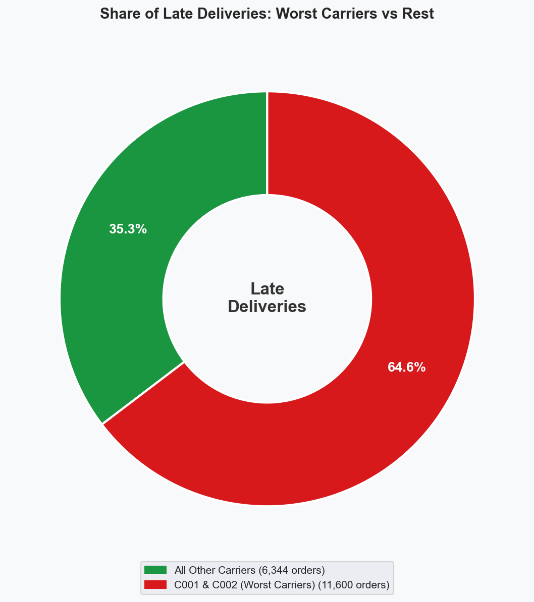
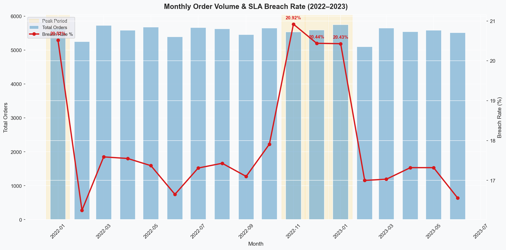

# Fulfilment Delay & SLA Breach Analysis

## Business Problem
Operations teams managing large fulfilment networks struggle to identify which carriers and routes are driving SLA breaches — especially during peak periods. Manual Excel reports lack the granularity to act quickly. This project analyses 100K+ orders across 18 months to pinpoint breach drivers and deliver actionable recommendations.

## Dataset
Synthetic dataset of 100,000 orders, localised to **Irish regions** (Leinster, Munster, Connacht, Ulster) for relevance to local analyst roles. Order schema follows standard e-commerce fulfilment fields (order ID, customer, seller, carrier, order/estimated/actual delivery dates, region, status, item count, order value, breach flag, delay days). 18 months of data: January 2022 – June 2023.

## Approach
1. Generated realistic synthetic order data with carrier-level performance variation across 10 carriers and a peak-period (Nov–Jan) modifier.
2. Loaded the raw CSV into DuckDB and ran 7 SQL queries computing breach rate as `SUM(sla_breach) / COUNT(*)` segmented by carrier, region, week, month, and peak vs non-peak. Identified outlier carriers via `ORDER BY breach_rate_pct DESC`, and used a window-aggregate query to quantify the share of late deliveries attributable to the top 2 worst carriers (`COUNT(*) * 100.0 / SUM(COUNT(*)) OVER ()`).
3. Persisted each query result to `data/processed/` as a CSV for downstream consumption, then visualised the findings across 7 charts in `notebooks/eda_notebook.ipynb`.
4. Exported Tableau-ready dashboard CSVs to `outputs/`.

## Key Findings
- **64.6% of all late deliveries trace to 2 carriers (C001, C002)** — 11,600 of 17,944 breaches — even though those two carriers handle only 20.1% of the order volume (20,085 of 100,000 orders), a 3.2× over-representation. Their breach rates run 55.6% non-peak / 65.2% peak versus 7.5% / 9.3% for the other 8 carriers — roughly 7× the rate in *both* periods, which points to structural route/hub issues rather than seasonal capacity strain. Average delay length once a breach occurs (~7.5 days) is similar across carrier groups, so the C001/C002 problem is breach *frequency*, not severity.
- **Peak periods (Nov–Jan) show 20.6% breach rate vs 17.2% in non-peak** — a 3.4 percentage-point lift across the network.
- **Leinster has the highest order volume** (45,277 orders, ~45% of total). Network-wide regional breach rates sit in a tight 17.6–18.7% band, so the C001/C002 driver dominates regional differences.





## Recommendations
1. **Route reallocation:** Redistribute C001/C002 volume to C005–C010 during peak periods *(assumes C005–C010 have available capacity headroom — verify before action)*.
2. **Peak staffing:** Increase capacity Nov–Jan based on the historical breach pattern.
3. **Lead-time buffers:** Add a 1-day buffer for C001/C002 routes until performance improves.
4. **Projected impact:** ~1.2 day reduction in average delivery delay *(illustrative projection based on synthetic data; real-world impact requires A/B validation)*.

## Tools
Python, SQL (DuckDB), pandas, matplotlib, seaborn, Tableau

## How to Run
```bash
pip install -r requirements.txt
python src/data_generation.py
python src/sql_analysis.py
python src/dashboard_export.py
jupyter notebook notebooks/eda_notebook.ipynb
```


- **Problem:** Ops team couldn't identify which carriers were causing SLA breaches
- **Data:** 100K synthetic orders, 18 months, 10 carriers, 4 Irish regions
- **Approach:** SQL analysis via DuckDB, 7 visualisations
- **Finding:** 2 carriers (C001/C002) account for 64.6% of late deliveries on 20.1% of volume — structural, not seasonal
- **Impact:** 3 recommendations targeting C001/C002 and peak-period staffing
